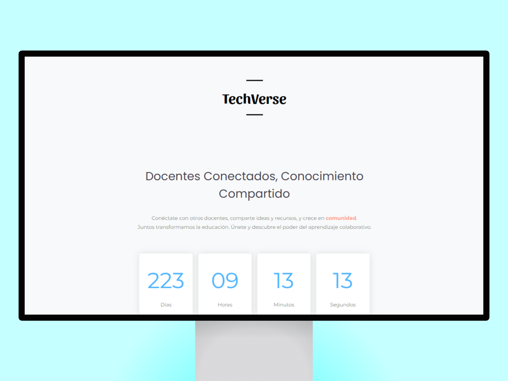

# TeachVerse

Bienvenido a **TeachVerse**, una plataforma diseñada específicamente para **docentes**. Aquí, los educadores pueden **conectarse**, **compartir ideas** y **recursos**, y crecer **juntos** en una comunidad **colaborativa**.

## Descripción

**TeachVerse** es una red social dedicada a los docentes, donde pueden interactuar entre ellos, compartir materiales educativos, discutir estrategias pedagógicas y apoyarse mutuamente en su desarrollo profesional. Nuestra misión es transformar la educación a través de la colaboración y el intercambio de conocimientos.

## Características

- **Intercambio de Recursos:** Comparte y accede a una amplia variedad de materiales educativos y planes de lecciones.
- **Colaboración en Proyectos:** Participa en proyectos colaborativos y enriquece tu práctica docente con nuevas ideas.
- **Soporte y Mentoría:** Encuentra apoyo y mentoría de colegas experimentados en la comunidad.

## Capturas de Pantalla

## Tecnologías Utilizadas

- **Frontend:** HTML5, CSS3, JavaScript, Bootstrap
- **Backend:** Aún nada.
- **Base de Datos:** Aún nada.
- **Hosting:** Vercel

## Contribuir

¡Contribuciones son bienvenidas! Por favor, sigue los pasos a continuación para contribuir:

1. Haz un fork del repositorio.
2. Crea una nueva rama (`git checkout -b feature/nueva-caracteristica`).
3. Realiza los cambios necesarios y haz commit (`git commit -m 'Añadir nueva característica'`).
4. Haz push a la rama (`git push origin feature/nueva-caracteristica`).
5. Abre un Pull Request.

## Licencia

Este proyecto está licenciado bajo la Licencia GNU. Consulta el archivo [LICENSE](LICENSE) para obtener más información.

## Contacto

Si tienes alguna pregunta o sugerencia, no dudes en contactar con nosotros en [nana@nana.com](mailto:nana@nana.com).

---

¡Gracias por visitar TeachVerse y ser parte de nuestra comunidad educativa!
