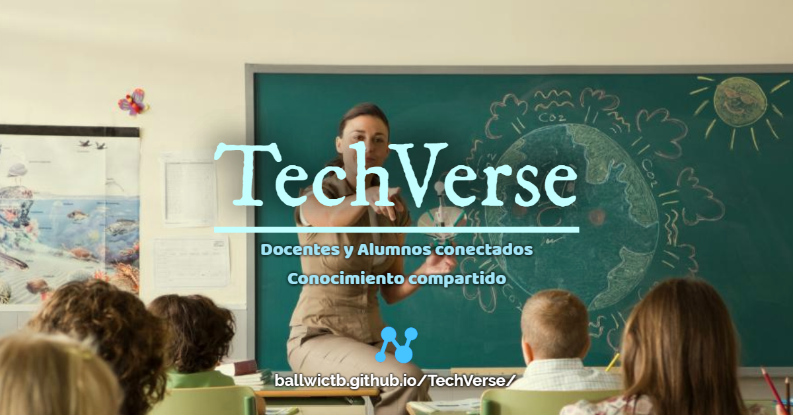
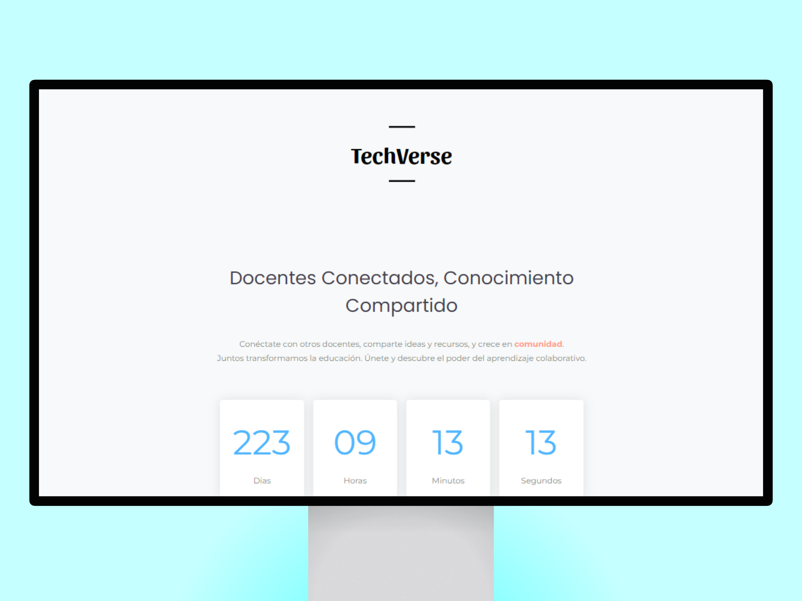

<h1>TeachVerse</h1>

 

Bienvenido a  <b>TeachVerse</b> , una plataforma diseñada para <b>docentes</b> y <b>alumnos</b>. Aquí pueden <b>conectarse</b>, 
  <b>compartir ideas</b> y <b>recursos</b> , y crecer <b>juntos</b> en una comunidad <b>colaborativa</b>.

## Descripción

**TeachVerse** es una red social dedicada a los docentes y alumnos, donde pueden interactuar entre ellos, compartir materiales educativos, discutir estrategias pedagógicas y apoyarse mutuamente en su desarrollo profesional y personal. Nuestra misión es transformar la educación a través de la colaboración y el intercambio de conocimientos.

## Características

- **Intercambio de Recursos:** Comparte y accede a una amplia variedad de materiales educativos y planes de lecciones.
- **Colaboración en Proyectos:** Participa en proyectos colaborativos y enriquece tu práctica docente con nuevas ideas.
- **Soporte y Mentoría:** Encuentra apoyo y mentoría de colegas experimentados en la comunidad.

## Capturas de Pantalla

## Tecnologías Utilizadas

- **Frontend:**

 
 
  Astro, React,Jquery

- **Backend:** PHP.
- **Base de Datos:** MySQL.
- **Hosting:** Github

## Licencia

Este proyecto está licenciado bajo la Licencia GNU. Consulta el archivo [LICENSE](LICENSE) para obtener más información.

## Contacto

Si tienes alguna pregunta o sugerencia, no dudes en contactar con nosotros en [nana@nana.com](mailto:nana@nana.com).

## 🧑‍💻 Participantes

---

> [!IMPORTANT]\
> Queremos hacer hincapié en que estamos llevando a cabo un **TFG (Trabajo de Fin de Grado)**.\
> Es importante destacar que **no** nos responsabilizamos por cualquier **daño** o **malentendido** que pueda surgir.

 

<b>¡Gracias por visitar TeachVerse y ser parte de nuestra comunidad educativa!</b>

